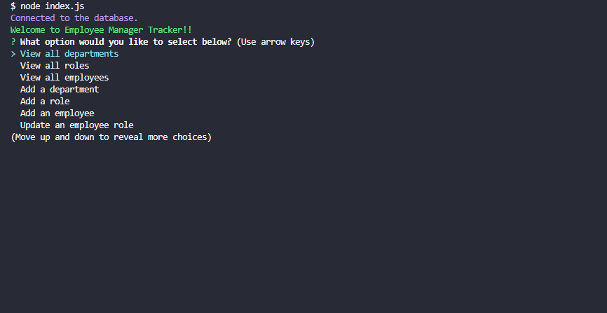
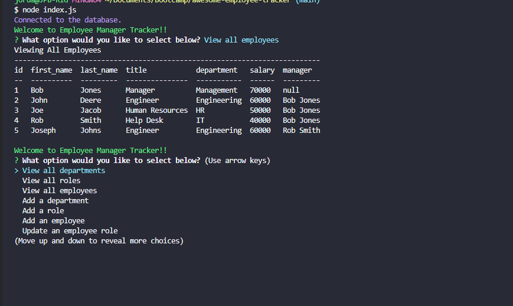

# awesome-employee-tracker

Employee Tracker using CLI

## Description

This an CLI (Command Line Interface) Employee Tracker app. This app allows you to see all departments, all employees, all roles at a company. You can in addition add employees, department or role, or update an employee role to the MySQL database. For the command line it is using Inquirer, for the display the information it using Console.Table, and for connecting to the database it using MySQL2.

## Screenshot(s)

## Link to Demo of App

[Demo of APP Link](https://drive.google.com/file/d/1Ha4uGV28i6ocTMEhBxG84ivhP3i6D8k4/view)
